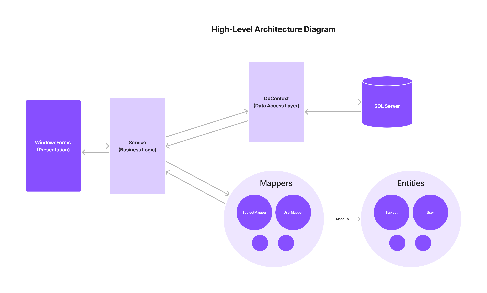
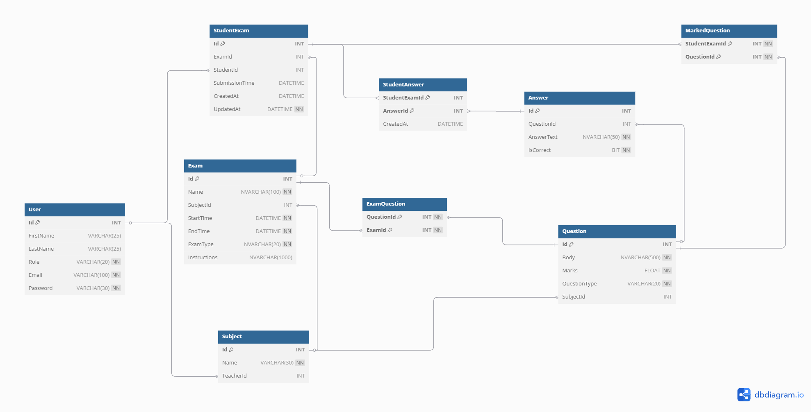

# Exami

## Overview

This project is a desktop application for an Examination System. It has three user roles: **admins, teachers, and students**. **Teachers** can create exams and questions. **Students** can log in securely and take **practice or final exams**. The system also generates exam result reports in different formats.

## Features

### Admin Features

- Manage **subjects, teachers, and students**.
- Assign exams to students.
- Generate exam reports.

### Teacher Features

- Create, edit, and delete **exams**.
- Add, edit, and remove **exam questions**.
- View exam reports.

### Student Features

- **Login** securely.
- View and start available exams.
- Mark **questions inside the exam** with bookmarks for review.
- See **scores and correct answers** after practice exams.

_For more details, Please review [System Requirements Specification Document](./attachments/docs/examination-system-requirements-doc.pdf)_

## Technologies

- **Programming Language**: C#
- **Framework**: .NET Core (Windows Forms)
- **Database**: SQL Server (Using ADO.NET for interaction)

## High-Level Architecture

Our project follows a simplified **multi-tier architecture** to ensure better organization and maintainability:

- **Entities (Data Model)** – Classes that map to database tables and represent the data structure.
- **Mappers**: Converts database rows (`DataRow` or `DataTable`) into entity objects and vice versa.
- **DbContext(Singleton Class)**: Handles all database interactions, such as executing queries and commands.
- **Service Layer (Business Logic)** – Contains the core logic of the system. This layer interacts with the database using the `DbContext` and mappers. SQL statements are written directly within service methods for simplicity.
- **Presentation Layer (UI)** – The **Windows Forms** application that interacts with users and provides an intuitive interface for admins, teachers, and students.



## File Structure

We use a **single .NET solution** with multiple projects, ensuring **a clear separation of concerns** and making development **structured and intuitive**. Below is the updated project structure:

### Solution Structure

- **Exami.Presentation** – A Windows Forms project that handles the user interface.

  - **Forms**: Contains forms for different user roles (e.g., `AdminForm.cs`, `TeacherForm.cs`, `StudentForm.cs`).
  - **Controls**: Custom UI controls if any.
  - **Resources**: Icons, images, and other resources.
  - **Helpers**: Contains any extra classes or helper methods.

- **Exami.Entities** – Defines data models mapped to database tables.

  - **Entities**: Includes classes like `User.cs`, `Exam.cs`, `Question.cs`, and `Answer.cs`.

- **Exami.Services** – Contains the core application logic.

  - **Services**: Implements business logic for different features (e.g., `ExamService.cs`, `UserService.cs`).
  - **DTOs**: Custom types for input/output used in service methods.
  - **Mappers**: Mapping logic between entities and DTOs if needed.
  - **Helpers**: Contains static classes with helper extension methods for services (e.g. `GetAllEntitiesHelper.cs`).

- **Exami.Utilities** – A helper project for common functionalities.

  - **Logging**: Logging utilities (e.g., `Logger.cs`).
  - **Config**: Configuration management (e.g., `AppConfig.cs`).
  - **Extensions**: Utility methods or extension methods.

- **Exami.Database** – Manages shared database logic.
  - **DbContext**: Handles all database interactions.
  - **DbCommandParams**: Encapsulates parameters for database commands.
  - **SqlQueryBuilder**: Builds SQL queries dynamically.
- **Exami.Test** – A console application used for **manual testing purposes** during development.
  - This project allows developers to test specific functionalities without running the full application.
  - **Note** : This project is **development-only** and will be **excluded from the final build and shipment** .

### Benefits of This Structure

- **Separation of Concerns**: Each project has a distinct responsibility, ensuring clean and maintainable code.
- **Scalability**: The structure makes it easier to add new features or enhance existing ones without affecting other parts of the system.
- **Maintainability**: Changes in one layer do not affect others, reducing the risk of unintended side effects.
- **Reusability**: Common functionalities are centralized in the `Exami.Utilities` and `Exami.Database` projects, promoting code reuse.

## Database Design



_For more details, Please review [Database Schema in detail using DBML](./attachments/docs/database-erd.dbml)_

## Class Diagram

The class diagram below illustrates the relationships between key classes in the system. It show how services interact with `DbContext` to perform operations and how it uses mappers to convert data from different formats like `DataTable` to entities.


## UI Design

We designed a **simple and user-friendly** Windows Forms interface, with separate screens for **Admins, Teachers, and Students**.

Each role gets an **easy-to-use interface** tailored to their tasks:

- **Admin Panel** – Manage users, subjects, and assign exams.
- **Teacher Panel** – Create exams, add questions, and view reports.
- **Student Panel** – View and take exams, bookmark questions, and see results.

Check out our [**prototype sketches on Figma**](https://www.figma.com/design/ZzDNDuK7cYCWJH04KFx1Gl/C%23-Project-UI?m=auto&t=BsQYRQdJ5xg0YcA6-1) for a preview of the design.

## Deployment

After development, we will **publish the application as a single executable file**, making installation **simple and user-friendly**.

### Deployment Steps

- **Build the application** in **Release mode**.
- **Use .NET’s Single-File Publishing** to generate a standalone executable.
- **Package the app** with an installer for easy setup.
- **Ensure dependencies** (like SQL Server) are correctly configured.
- **Distribute the installer** to users.

## Installation

### Development Installation

1. **Clone the Repository**:

   ```bash
   git clone <repository-url>
   ```

2. **Open the Solution in Visual Studio** (`\Exami` Directory).
3. **Restore NuGet Packages**: Let Visual Studio restore the packages automatically, or manually restore them using:

   ```bash
   dotnet restore
   ```

4. **Set Up Configuration**:

   - Copy `appsettings.example.json` to `appsettings.json`:

   ```bash
   copy Utility\appsettings.example.json Utility\appsettings.json
   ```

   - Update the values in `appsettings.json` with local environment-specific settings.

5. **Configure Database** : Set up the database locally using those [scripts](./scripts/db/) and update the connection string in `appsettings.json`.

6. **Build and Run**:

   - Build the solution (`Ctrl + Shift + B` in Visual Studio).
   - Run the application to ensure everything is set up correctly.

## Conclusion

This **Examination Management System** makes exams **easier to create, take, and manage**. It has a **clear structure** with different roles for **admins, teachers, and students**.

With **secure logins, exam reports, and question bookmarking**, it helps students and teachers **use exams smoothly**. Built with **C#, SQL Server, and Windows Forms**, it is **simple, fast, and reliable**.

## License

This repository is licensed under the MIT License - see the [LICENSE](./LICENSE) file for details.

## Glossary

This section defines key terms and concepts used throughout the documentation:

- **Entities**:
  Classes that represent data models and map directly to database tables. For example, `User`, `Exam`, and `Question` are entities in this project.

- **DbContext**:
  A utility class responsible for handling all interactions with the database. It executes SQL queries and commands, such as inserting, updating, or retrieving data.

- **DTO (Data Transfer Object)**:
  A lightweight object used to transfer data between different layers of the application. DTOs simplify communication by encapsulating only the necessary data for a specific operation.

- **Service**:
  A component in the business logic layer that contains the core functionality of the system. Services handle operations like creating exams, managing users, or calculating scores.

- **Mappers**:
  Classes or methods that convert data between different formats. In this project, mappers are used to transform database rows (`DataRow` or `DataTable`) into entity objects and vice versa.

- **UI (User Interface)**:  
  The part of the application that users interact with. In this project, the UI is built using Windows Forms.

- **Business Logic**:  
  The rules and processes that govern how the application works. In this project, business logic is implemented in the service layer.

- **Data Access Layer**:  
  The layer responsible for interacting with the database. In this project, the `DbContext` acts as the data access layer.

- **Presentation Layer**:  
  The layer responsible for displaying information to users and collecting input. In this project, the presentation layer is implemented using Windows Forms.

- **Configuration Files**:  
  Files used to store application settings, such as connection strings or logging configurations. In this project, `appsettings.json` or similar files are used to manage configuration.

- **Logging**:  
  The process of recording events or errors that occur during application execution. This project uses basic logging (e.g., `Debug.WriteLine`) for debugging purposes or more advanced logging libraries for production environments.

- **ERD (Entity Relationship Diagram)**:  
   A visual representation of database tables and their relationships. The ERD in this project shows how tables like `User`, `Exam`, and `Question` are connected.

- **ADO.NET**:  
  A .NET framework for interacting with databases. This project uses ADO.NET components like `SqlConnection`, `SqlCommand`, and `SqlDataAdapter` to execute database operations.

- **Microsoft.Data.SqlClient**:  
  A library in .NET for working with SQL Server databases. It provides classes like `SqlConnection` and `SqlCommand` for database interaction.
